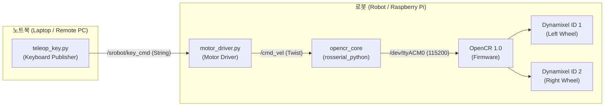

# srobot (SRobot Teleop & Direct Motor Control)

> **경량 로봇 텔레옵 및 OpenCR 다이나믹셀 직접 제어 ROS 1 Noetic 패키지**  
> 복잡한 전체 브링업(LiDAR, 카메라 등) 없이, **단 하나의 런치 명령**으로 다이나믹셀 모터를 구동하고 원격 노트북에서 실시간 키보드로 주행을 제어합니다.  
> 
> 학생 교육 및 수업용 실습 가이드는 **[학생용 실습 가이드](STUDENT_GUIDE.md)**를 참고하세요.

---

## 목차 (Table of Contents)

- [주요 특징](#주요-특징-key-features)
- [시스템 아키텍처](#시스템-아키텍처-architecture)
- [토픽 및 인터페이스](#토픽-및-인터페이스-topics--interfaces)
- [사전 준비 (Prerequisites)](#사전-준비-prerequisites)
- [네트워크 환경 설정](#네트워크-환경-설정-network-configuration)
- [빠른 시작 (Quick Start)](#빠른-시작-quick-start)
- [키보드 조작 가이드](#키보드-조작-가이드-controls)
- [부팅 시 자동 실행 (Systemd)](#부팅-시-자동-실행-systemd-auto-start)
- [문제 해결 (Troubleshooting)](#문제-해결-troubleshooting)
- [라이선스](#라이선스-license)

---

## 주요 특징 (Key Features)

1. **원터치 브링업 & 모터 제어 통합 (`robot.launch`)**
   - 라이다나 카메라 등 불필요한 노드 없이, OpenCR 통신(`rosserial`)과 모터 드라이버를 단일 프로세스로 구동합니다.
2. **엔터(Enter) 없는 즉각적인 실시간 키보드 입력 (`teleop.launch`)**
   - Linux Raw Terminal(termios)을 통해 키를 누르는 즉시 로봇이 반응합니다.
3. **주행 중 실시간 속도 조절 지원**
   - 로봇이 주행 중인 상태에서도 정지할 필요 없이 `e` / `c` 키로 실시간 속도를 즉각 증감할 수 있습니다.
4. **네트워크 자동 감지 스크립트 (`run_teleop.sh`)**
   - 노트북의 현재 IP를 자동 감지하여 `ROS_IP`를 할당하므로, Wi-Fi 환경이 바뀌어도 `.bashrc`를 수정할 필요가 없습니다.
5. **초보자 및 교육 친화적 코드**
   - 복잡한 특수 문자나 난해한 시스템 코드를 배제하여, 학생들이 직접 타이핑하고 이해하기 쉬운 구조로 제작되었습니다.

---

## 시스템 아키텍처 (Architecture)



---

## 토픽 및 인터페이스 (Topics & Interfaces)

| 토픽명 (Topic) | 메시지 타입 (Type) | 발행자 (Publisher) | 구독자 (Subscriber) | 설명 |
|:---|:---|:---|:---|:---|
| `/srobot/key_cmd` | `std_msgs/String` | `teleop_key.py` | `motor_driver.py` | 실시간 키 입력 문자열 전달 |
| `/cmd_vel` | `geometry_msgs/Twist` | `motor_driver.py` | `opencr_core` | 로봇 모터 속도 지휘값 (선속도/각속도) |

---

## 사전 준비 (Prerequisites)

로봇(라즈베리파이)에서 OpenCR 보드와 시리얼 통신을 위해 `rosserial` 패키지 설치 및 시리얼 포트 권한이 필요합니다.

```bash
# 로봇 터미널에서 실행
sudo apt update
sudo apt install -y ros-noetic-rosserial-python ros-noetic-rosserial-msgs
sudo usermod -aG dialout $USER
```

---

## 네트워크 환경 설정 (Network Configuration)

> **안내:** 개인 PC의 `~/.bashrc` 환경변수는 깃허브에서 클론해도 자동 적용되지 않으므로, 아래 안내에 따라 자신의 IP에 맞게 설정해야 합니다.

* **내 IP 확인:** `hostname -I`

### 1) 로봇 (Robot):
```bash
export ROS_MASTER_URI=http://<로봇IP>:11311
export ROS_IP=<로봇IP>
```

### 2) 노트북 (Laptop):
```bash
export ROS_MASTER_URI=http://<로봇IP>:11311
export ROS_IP=<노트북IP>
```

---

## 빠른 시작 (Quick Start)

### 1. 패키지 다운로드 및 빌드

노트북과 로봇의 catkin 워크스페이스에 각각 다운로드하여 빌드합니다.

```bash
cd ~/turtle_ws/src
git clone https://github.com/seongjun-k/srobot.git
cd ~/turtle_ws
catkin_make
source devel/setup.bash
```

### 2. 실행 방법

#### [1단계] 로봇에서 모터 노드 실행 (Robot)
```bash
roslaunch srobot robot.launch
```

#### [2단계] 노트북에서 텔레옵 콘솔 실행 (Laptop)

**방법 A. 간편 원클릭 실행 (내 IP 자동 감지, 추천):**
```bash
cd ~/turtle_ws/src/srobot
./run_teleop.sh <로봇IP>
```

**방법 B. 일반 roslaunch 실행:**
```bash
roslaunch srobot teleop.launch
```

---

## 키보드 조작 가이드 (Controls)

키를 누르면 엔터 없이 즉시 로봇이 반응합니다.

| 키 (Key) | 동작 (Action) | 상세 설명 |
|:---:|:---|:---|
| **`w`** | 전진 (Forward) | 현재 설정된 선속도로 전진 주행 |
| **`x`** | 후진 (Backward) | 현재 설정된 선속도로 후진 주행 |
| **`a`** | 좌회전 (Turn Left) | 제자리 반시계방향 좌회전 |
| **`d`** | 우회전 (Turn Right) | 제자리 시계방향 우회전 |
| **`s`** | 정지 (Stop) | 주행 모터 즉각 정지 |
| **`Space`** | 정지 (Stop) | 주행 모터 즉각 정지 |
| **`e` / `c`** | 속도 증가 / 감소 | 선속도 ± 0.02 m/s 단위 조절 (기본값: 0.15 m/s) |
| **`q`** | 안전 종료 (Quit) | 모터 정지 후 안전하게 프로그램 종료 |

> **실시간 속도 조절:** 로봇 주행 중에도 `e`, `c` 키를 누르면 멈추지 않고 즉시 속도가 변경됩니다.

---

## 부팅 시 자동 실행 (Systemd Auto-Start)

로봇에 매번 SSH로 접속하여 명령어를 치는 번거로움을 없애려면 로봇에 systemd 서비스를 등록할 수 있습니다.

```bash
# 로봇 터미널에서 1회 등록
sudo cp $(rospack find srobot)/service/srobot.service /etc/systemd/system/
sudo systemctl daemon-reload
sudo systemctl enable srobot.service
sudo systemctl start srobot.service
```

* **상태 확인:** `sudo systemctl status srobot.service`
* **서비스 중지:** `sudo systemctl stop srobot.service`

서비스 활성화 시 로봇 전원만 켜면 백그라운드에서 자동 대기하므로, 노트북에서 `./run_teleop.sh <로봇IP>`만 켜면 즉시 주행할 수 있습니다.

---

## 문제 해결 (Troubleshooting)

### Q1. `cannot launch node of type [rosserial_python/serial_node.py]` 에러
* **해결:** 로봇에서 `sudo apt install ros-noetic-rosserial-python ros-noetic-rosserial-msgs`를 실행합니다.

### Q2. `RLException: ERROR: unable to contact ROS master` 에러
* **해결 점검:**
  1. 로봇과 노트북이 동일한 Wi-Fi에 연결되어 있는지 확인 (`ping <로봇IP>`)
  2. 로봇에서 `robot.launch` 또는 roscore가 실행 중인지 확인
  3. `echo $ROS_MASTER_URI`, `echo $ROS_IP` 주소 확인

### Q3. `Permission denied: '/dev/ttyACM0'` 에러
* **해결:** `sudo usermod -aG dialout $USER` 실행 후 재로그인합니다.

---

## 라이선스 (License)

MIT License - Copyright (c) seongjun-k
