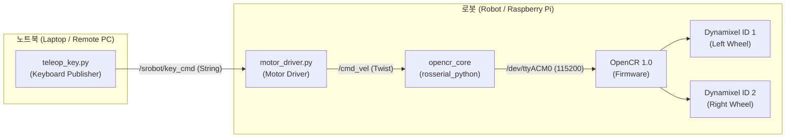

# srobot (SRobot Teleop & Direct Motor Control)

> **경량 로봇 텔레옵 및 OpenCR 다이나믹셀 직접 제어 ROS 1 Noetic 패키지**  
> 복잡하고 무거운 전체 브링업(LiDAR, 카메라, 진단 노드 등)을 일일이 실행할 필요 없이, **단 하나의 런치 명령**으로 다이나믹셀 모터를 구동하고 원격 노트북에서 실시간 키보드로 주행을 제어합니다.

---

## 목차 (Table of Contents)

- [주요 특징](#주요-특징-key-features)
- [시스템 아키텍처](#시스템-아키텍처-architecture)
- [토픽 및 인터페이스](#토픽-및-인터페이스-topics--interfaces)
- [사전 준비 및 의존성 설치](#사전-준비-및-의존성-설치-prerequisites)
- [네트워크 환경 설정](#네트워크-환경-설정-network-configuration)
- [빠른 시작](#빠른-시작-quick-start)
- [키보드 조작 가이드](#키보드-조작-가이드-controls)
- [부팅 시 자동 실행 (Systemd)](#고급-로봇-부팅-시-완전-자동-실행-systemd-auto-start)
- [문제 해결 (Troubleshooting)](#문제-해결-troubleshooting)
- [라이선스](#라이선스-license)

---

## 주요 특징 (Key Features)

1. **원터치 브링업 & 모터 제어 통합 (`robot.launch`)**
   - 로봇 측에서 라이다나 카메라 등 불필요한 노드를 띄울 필요 없이, OpenCR 통신(`rosserial`)과 모터 드라이버를 단일 프로세스로 구동합니다.
2. **엔터(Enter) 없는 즉각적인 실시간 키보드 입력 (`teleop.launch`)**
   - 표준 `input()` 기반 입력 방식의 딜레이를 제거하고, Linux Raw Terminal(termios)을 통해 키를 누르는 즉시 로봇이 반응합니다.
3. **주행 중 실시간 속도 조절 지원**
   - 로봇이 주행(전진/후진/회전) 중인 상태에서도 정지할 필요 없이 실시간으로 선속도 및 각속도를 즉각 증감할 수 있습니다.
4. **네트워크 환경 자동 감지 스크립트 (`run_teleop.sh`)**
   - 노트북의 현재 IP를 자동으로 감지하여 `ROS_IP`를 할당하므로, Wi-Fi 환경이 바뀌어도 `.bashrc`를 매번 수정할 필요가 없습니다.
5. **안전 기능 (Fail-Safe)**
   - 제어 신호 단절 시 자동 정지(타임아웃 지원)
   - 종료(Ctrl+C 또는 `q`) 시 모터 즉각 정지 명령 전송으로 폭주 방지
6. **(선택 사항) 로봇 부팅 시 백그라운드 자동 실행**
   - systemd 서비스 등록 시 로봇 전원만 켜면 자동으로 구동되어 로봇에 SSH 접속조차 할 필요가 없습니다.

---

## 시스템 아키텍처 (Architecture)



---

## 토픽 및 인터페이스 (Topics & Interfaces)

| 토픽명 (Topic) | 메시지 타입 (Type) | 발행자 (Publisher) | 구독자 (Subscriber) | 설명 |
|:---|:---|:---|:---|:---|
| `/srobot/key_cmd` | `std_msgs/String` | `teleop_key.py` | `motor_driver.py` | 실시간 키 입력 문자열 전달 |
| `/cmd_vel` | `geometry_msgs/Twist` | `motor_driver.py` | `opencr_core` | 로봇 모터 속도 지휘값 (선속도/각속도) |

---

## 사전 준비 및 의존성 설치 (Prerequisites)

### 1. 로봇 (Raspberry Pi / Onboard PC)

OpenCR과의 USB 시리얼 통신을 위해 `rosserial` 패키지 설치 및 시리얼 포트 접근 권한이 필요합니다.

```bash
# rosserial 패키지 설치
sudo apt update
sudo apt install -y ros-noetic-rosserial-python ros-noetic-rosserial-msgs

# 시리얼 포트(/dev/ttyACM0) 접근 권한 부여 (실행 후 재부팅 또는 재로그인)
sudo usermod -aG dialout $USER
```

### 2. 노트북 (Remote PC)

기본 ROS Noetic 데스크탑 설치본(`ros-noetic-desktop` 또는 `desktop-full`)이 준비되어 있으면 추가 패키지 없이 동작합니다.

---

## 네트워크 환경 설정 (Network Configuration)

> **안내:** 깃허브에서 저장소를 내려받더라도 각자의 네트워크 환경과 IP 주소가 다르므로, 개인 PC의 `~/.bashrc` 환경변수는 자동으로 설정되지 않습니다. 아래 안내에 따라 환경에 맞게 설정해야 합니다.

### 내 IP 확인 방법

터미널에서 아래 명령어로 현재 연결된 Wi-Fi의 IP 주소를 확인합니다.

```bash
hostname -I
```

### 환경변수 설정 방식

#### 방식 A. 원클릭 실행 스크립트 사용 (권장)
노트북에서 `./run_teleop.sh <로봇IP>`를 실행하면 자신의 IP를 자동으로 감지하여 `ROS_IP`를 세팅하므로 `.bashrc`를 일일이 고칠 필요가 없습니다.

#### 방식 B. 환경변수 직접 지정
터미널을 열 때마다 직접 입력하거나 각 장치의 `~/.bashrc` 하단에 등록합니다.

**1) 로봇 (Robot):**
```bash
export ROS_MASTER_URI=http://<ROBOT_IP>:11311
export ROS_IP=<ROBOT_IP>
```

**2) 노트북 (Laptop):**
```bash
export ROS_MASTER_URI=http://<ROBOT_IP>:11311
export ROS_IP=<LAPTOP_IP>
```

*(동일한 로컬 Wi-Fi 망에 연결되어 있어야 하며, Tailscale 또는 VPN 가상 사설망 IP를 사용해도 무방합니다)*

---

## 빠른 시작 (Quick Start)

### 1. 패키지 다운로드 및 빌드

노트북과 로봇의 catkin 워크스페이스에 각각 복사하여 빌드합니다.

```bash
cd ~/turtle_ws/src      # 또는 ~/catkin_ws/src
git clone https://github.com/seongjun-k/srobot.git
cd ~/turtle_ws          # 또는 ~/catkin_ws
catkin_make
source devel/setup.bash
```

---

### 2. 실행 (Execution)

#### [Step 1] 로봇에서 모터 노드 실행 (Robot)

로봇에 SSH 접속 후 다음 명령어를 실행합니다:

```bash
roslaunch srobot robot.launch
```

*(OpenCR 연결과 모터 서브스크라이버가 하나의 프로세스로 시작됩니다)*

#### [Step 2] 노트북에서 텔레옵 콘솔 실행 (Laptop)

노트북 터미널에서 다음 중 편한 방식으로 실행합니다:

**방법 1: 자동 IP 감지 스크립트 사용 (추천)**
```bash
cd ~/turtle_ws/src/srobot
./run_teleop.sh <로봇IP>
```
> 로봇 IP를 인자로 전달하면 노트북의 현재 IP를 자동으로 찾아 즉시 연결합니다.

**방법 2: 일반 roslaunch 실행**
```bash
roslaunch srobot teleop.launch
```

실행 후 화면에 키 안내가 표시되며, `w`, `a`, `s`, `d`, `x`를 눌러 즉시 로봇을 조종할 수 있습니다.

---

## 키보드 조작 가이드 (Controls)

키를 누르고 Enter를 칠 필요 없이, 키를 누르는 즉시 로봇이 반응합니다.

| 키 (Key) | 동작 (Action) | 상세 설명 |
|:---:|:---|:---|
| **`w`** | 전진 (Forward) | 현재 설정된 선속도로 전진 주행 |
| **`x`** | 후진 (Backward) | 현재 설정된 선속도로 후진 주행 |
| **`a`** | 좌회전 (Turn Left) | 제자리 반시계방향 좌회전 |
| **`d`** | 우회전 (Turn Right) | 제자리 시계방향 우회전 |
| **`s`** | 정지 (Stop) | 주행 모터 즉각 정지 |
| **`Space`** | 비상 정지 (Emergency) | 속도를 0으로 즉시 강제 리셋 |
| **`e` / `c`** | 선속도 증가 / 감소 | ± 0.02 m/s 단위 조절 (기본값: 0.15 m/s) |
| **`r` / `v`** | 각속도 증가 / 감소 | ± 0.10 rad/s 단위 조절 (기본값: 0.75 rad/s) |
| **`q`** | 안전 종료 (Quit) | 모터 정지 명령 전달 후 안전하게 종료 |

> **주행 중 실시간 속도 조절 지원:** 로봇이 주행하고 있는 상태에서도 `e`, `c`, `r`, `v` 키를 누르면 로봇을 멈출 필요 없이 즉시 주행 속도가 변경됩니다.

---

## (고급) 로봇 부팅 시 완전 자동 실행 (Systemd Auto-Start)

로봇에 매번 SSH로 접속하여 명령어를 치는 번거로움을 없애려면 로봇에 systemd 서비스를 등록할 수 있습니다.

```bash
# 로봇 터미널에서 1회 등록
sudo cp $(rospack find srobot)/service/srobot.service /etc/systemd/system/
sudo systemctl daemon-reload
sudo systemctl enable srobot.service
sudo systemctl start srobot.service
```

- **상태 확인:** `sudo systemctl status srobot.service`
- **서비스 중지:** `sudo systemctl stop srobot.service`

서비스를 활성화하면 로봇 전원만 켜도 백그라운드에서 `srobot`이 대기하므로, **노트북에서 `./run_teleop.sh <로봇IP>`만 켜면 언제든 즉시 주행**할 수 있습니다.

---

## 문제 해결 (Troubleshooting)

### Q1. `cannot launch node of type [rosserial_python/serial_node.py]: rosserial_python` 에러가 발생합니다.
- **원인:** 로봇에 `rosserial_python` 패키지가 설치되어 있지 않습니다.
- **해결:** 로봇에서 다음 명령어로 설치합니다:
  ```bash
  sudo apt install ros-noetic-rosserial-python ros-noetic-rosserial-msgs
  ```

### Q2. `RLException: ERROR: unable to contact ROS master at [http://<ROBOT_IP>:11311]` 에러가 발생합니다.
- **원인:** 노트북이 로봇의 ROS 마스터에 연결하지 못했습니다.
- **해결 점검 순서:**
  1. 로봇과 노트북이 동일한 Wi-Fi 네트워크에 연결되어 있는지 확인합니다.
  2. 노트북에서 `ping <로봇IP>`가 정상 응답하는지 확인합니다.
  3. 로봇 측에서 `roslaunch srobot robot.launch` (또는 roscore)가 먼저 실행 중인지 확인합니다.
  4. 노트북의 `ROS_MASTER_URI`와 `ROS_IP`가 올바르게 설정되었는지 확인합니다 (`echo $ROS_MASTER_URI`, `echo $ROS_IP`).

### Q3. `[Errno 13] Permission denied: '/dev/ttyACM0'` 에러가 발생합니다.
- **원인:** 현재 사용자에게 OpenCR 시리얼 포트 접근 권한이 없습니다.
- **해결:** 로봇에서 다음 명령을 실행한 후 재로그인합니다:
  ```bash
  sudo usermod -aG dialout $USER
  ```

### Q4. 명령을 내려도 모터가 회전하지 않습니다.
- **해결 점검 순서:**
  1. OpenCR 보드의 전원 스위치가 ON 상태인지 확인합니다.
  2. 배터리 전압이 부족하지 않은지 확인합니다.
  3. 다이나믹셀 모터 케이블 접촉 상태 및 ID(왼쪽 바퀴: 1, 오른쪽 바퀴: 2) 설정을 확인합니다.

---

## 라이선스 (License)

MIT License - Copyright (c) seongjun-k
